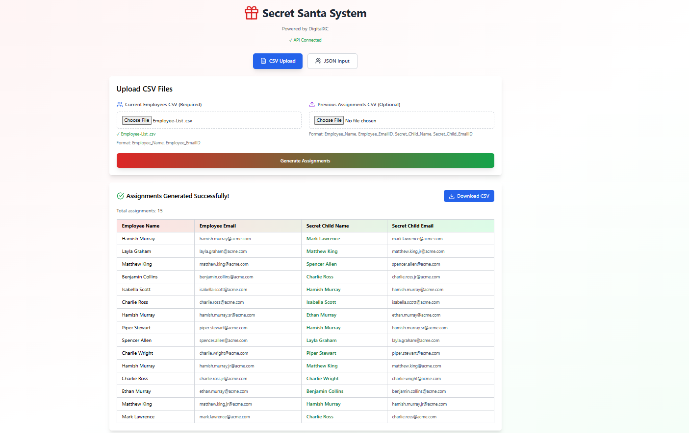
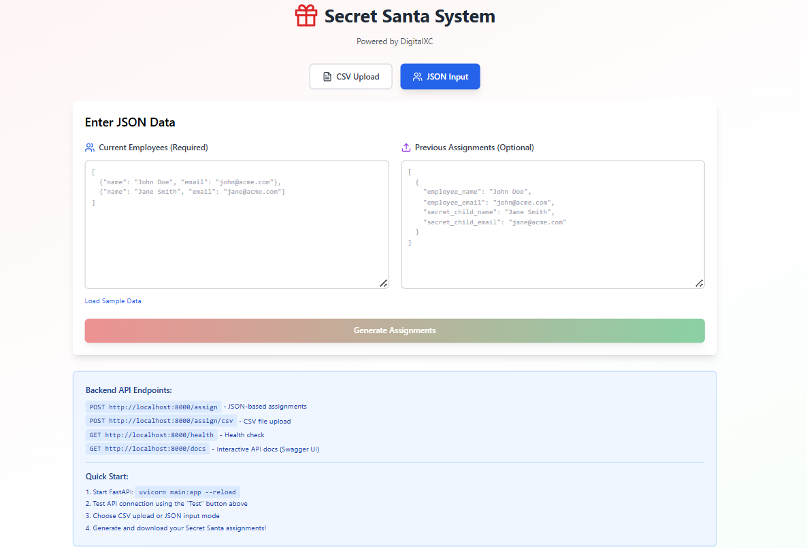

🎅 Secret Santa Assignment System
A comprehensive Secret Santa gift exchange automation system built with FastAPI (Backend) and React (Frontend). The system automatically assigns secret children to employees while respecting constraints and previous year assignments.

📋 Table of Contents

Features
Architecture
Requirements
Installation
Running the Application
API Documentation
Project Structure
Usage Examples
Testing
Error Handling
Contributing
License

✨ Features
Core Functionality

✅ No Self-Assignment: Employees cannot be assigned to themselves
✅ No Same-Name Assignment: Prevents assigning to someone with the same name
✅ Previous Year Constraint: Avoids duplicate assignments from previous year
✅ Unique Assignments: Each employee gets exactly one secret child
✅ Fair Distribution: Each person is assigned as a secret child to exactly one person

Technical Features

🏗️ Modular OOP Design: Separation of concerns with dedicated classes
🔒 Type Safety: Pydantic models with comprehensive validation
📊 Dual Input Methods: Support for both CSV files and JSON API
🎨 Interactive UI: Beautiful React frontend with real-time feedback
📝 Auto-generated API Docs: Swagger UI and ReDoc documentation
⚡ Fast & Efficient: Optimized assignment algorithm
🧪 Comprehensive Tests: Unit tests for all components
🛡️ Robust Error Handling: Detailed error messages and validation

🏛️ Architecture
┌─────────────────────────────────────────────────────┐
│                  React Frontend                      │
│  (CSV Upload / JSON Input / Results Display)        │
└──────────────────┬──────────────────────────────────┘
                   │ HTTP/REST API
                   ▼
┌─────────────────────────────────────────────────────┐
│              FastAPI Backend                         │
├─────────────────────────────────────────────────────┤
│  ┌─────────────────────────────────────────┐        │
│  │     API Layer (main.py)                 │        │
│  │  - /assign (JSON)                       │        │
│  │  - /assign/csv (File Upload)            │        │
│  │  - /health                              │        │
│  └──────────────┬──────────────────────────┘        │
│                 ▼                                    │
│  ┌─────────────────────────────────────────┐        │
│  │   Service Layer                         │        │
│  │  - SecretSantaService                   │        │
│  └──────────────┬──────────────────────────┘        │
│                 ▼                                    │
│  ┌─────────────────────────────────────────┐        │
│  │   Business Logic Layer                  │        │
│  │  - SecretSantaAssigner                  │        │
│  │  - AssignmentValidator                  │        │
│  │  - AssignmentHistory                    │        │
│  └──────────────┬──────────────────────────┘        │
│                 ▼                                    │
│  ┌─────────────────────────────────────────┐        │
│  │   Data Layer                            │        │
│  │  - EmployeeRepository                   │        │
│  │  - CSVHandler                           │        │
│  └─────────────────────────────────────────┘        │
└─────────────────────────────────────────────────────┘

📦 Requirements
Backend

Python 3.8 or higher
pip (Python package manager)

Frontend

Node.js 14+ (for local React development)
Modern web browser (Chrome, Firefox, Safari, Edge)

🚀 Installation
1. Clone the Repository
bashgit clone https://github.com/Richiesam1999/DigitalXC_Secret_Santa.git
cd secret-santa-system
2. Backend Setup
bash# Create virtual environment
python -m venv venv

# Activate virtual environment
# On Windows:
venv\Scripts\activate
# On macOS/Linux:
source venv/bin/activate

# Install dependencies
pip install -r requirements.txt
requirements.txt:
fastapi==0.104.1
uvicorn==0.24.0
pydantic==2.5.0
pydantic[email]
python-multipart==0.0.6
pytest==7.4.3
pytest-asyncio==0.21.1
httpx==0.25.1
3. Frontend Setup 
The React frontend is provided as a standalone component that can run in:
application
Static HTML file

For local development:
cd secret-santa-frontend 
npm install, npm run dev

🎯 Running the Application
Start the Backend Server
bash# Activate virtual environment (if not already active)
source venv/bin/activate  # or venv\Scripts\activate on Windows

# Run the FastAPI server
uvicorn main:app --reload
# Run react 
npm run dev

# Server will start at: http://localhost:5173
# Front end Server will start at: http://localhost:8000
Access the Application

API Documentation (Swagger UI): http://localhost:8000/docs
Alternative Docs (ReDoc): http://localhost:8000/redoc
Health Check: http://localhost:8000/health
Frontend: Open the React component in your browser

📚 API Documentation
Base URL
http://localhost:8000
Endpoints
1. Health Check
httpGET /health
Response:
json{
  "status": "healthy"
}

2. Generate Assignments (JSON)
httpPOST /assign
Content-Type: application/json
Request Body:
json{
  "current_employees": [
    {
      "name": "John Doe",
      "email": "john.doe@acme.com"
    },
    {
      "name": "Jane Smith",
      "email": "jane.smith@acme.com"
    }
  ],
  "previous_assignments": [
    {
      "employee_name": "John Doe",
      "employee_email": "john.doe@acme.com",
      "secret_child_name": "Jane Smith",
      "secret_child_email": "jane.smith@acme.com"
    }
  ]
}
Response:
json{
  "success": true,
  "message": "Assignments generated successfully",
  "assignments": [
    {
      "employee_name": "John Doe",
      "employee_email": "john.doe@acme.com",
      "secret_child_name": "Jane Smith",
      "secret_child_email": "jane.smith@acme.com"
    }
  ],
  "total_assignments": 2
}

3. Generate Assignments (CSV Upload)
httpPOST /assign/csv
Content-Type: multipart/form-data
Form Data:

employees_file: CSV file with current employees (required)
previous_assignments_file: CSV file with previous assignments (optional)

Response:

CSV file download with assignments

CSV Format - Employees:
csvEmployee_Name,Employee_EmailID
John Doe,john.doe@acme.com
Jane Smith,jane.smith@acme.com
CSV Format - Previous Assignments:
csvEmployee_Name,Employee_EmailID,Secret_Child_Name,Secret_Child_EmailID
John Doe,john.doe@acme.com,Jane Smith,jane.smith@acme.com

secret-santa-services/
├── |
│   ├── main.py                      # FastAPI application entry point
│   ├── models.py                    # Pydantic models
│   ├── exceptions.py                # Custom exceptions
│   ├── csv_handler.py               # CSV parsing and generation
│   ├── employee_repository.py       # Employee data management
│   ├── assignment_history.py        # Previous assignment tracking
│   ├── assignment_validator.py      # Validation rules
│   ├── secret_santa_assigner.py     # Core assignment logic
│   ├── secret_santa_service.py      # Service layer
│   ├
│   └── tests/
│       ├── __init__.py
│       ├── test_models.py
│       ├── test_csv_handler.py
│       ├ test_api.py
│       
│       
│       
├──  React/
│   └── src      # React component
├      └──SecretSantaFrontend.jsx  
│   
│── requirements.txt      
├── README.md                        # This file
├── LICENSE
└── .gitignore

API Curl requests (Postman)

bashcurl -X POST "http://localhost:8000/assign" \
  -H "Content-Type: application/json" \
  -d '{
    "current_employees": [
      {"name": "Alice", "email": "alice@acme.com"},
      {"name": "Bob", "email": "bob@acme.com"},
      {"name": "Charlie", "email": "charlie@acme.com"}
    ]
  }'

  cURL (only employees CSV)
curl -X POST "http://localhost:8000/assign/csv" \
  -H "accept: text/csv" \
  -F "employees_file=@employees.csv"

  With previous_assignments_file (optional file)
curl -X POST "http://localhost:8000/assign/csv" \
  -H "accept: text/csv" \
  -F "employees_file=@employees.csv" \
  -F "previous_assignments_file=@previous.csv"

Testing
The project includes comprehensive unit tests for all components.
Running Tests
bash# Install test dependencies
pip install pytest pytest-asyncio httpx

# Run all tests
pytest

# Run with coverage
pytest --cov=. --cov-report=html

# Run specific test file
pytest tests/test_api.py

# Run with verbose output
pytest -v